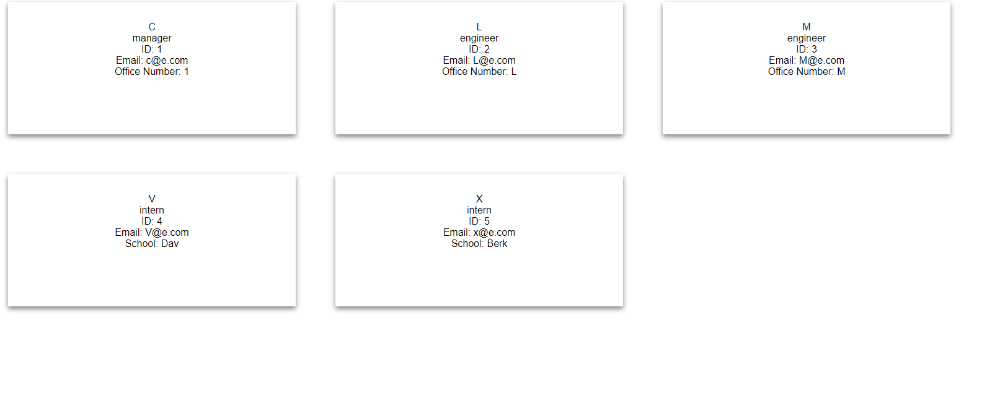
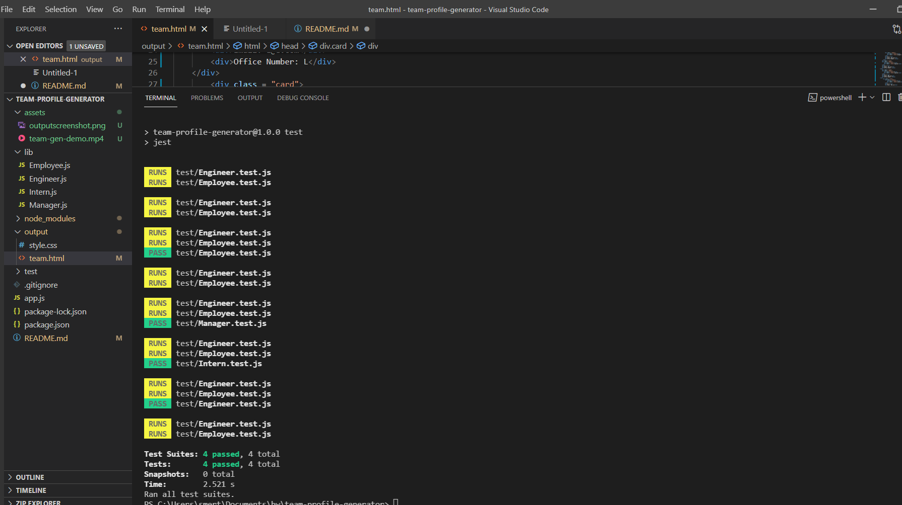

# Team-Profile-Generator

## TABLE OF CONTENTS

* [About](#about)
* [Criteria](#criteria)
* [Install](#install)
* [Journey](#journey)
* [Demo](#demo)

## About

I want to generate a webpage that displays a team's basic info in order to have quick access to their emails and GitHub profiles

## App cirteria 

 - Given a command-line application that accepts user input, when I am prompted for my team members and their information, then an HTML file is generated that displays a nicely formatted team roster based on user input.
 - When I click on an email address in the HTML then my default email program opens and populates the TO field of the email with the address
 - When I click on the GitHub username, then that GitHub profile opens in a new tab
 - When I start the application then I am prompted to enter the team manager’s name, employee ID, email address, and office number
 - When I enter the team manager’s name, employee ID, email address, and office number then I am presented with a menu with the option to add an engineer or an intern or to finish building my team
 - When I select the engineer option then I am prompted to enter the engineer’s name, ID, email, and GitHub username, and I am taken back to the menu
 - When I select the intern option then I am prompted to enter the intern’s name, ID, email, and school, and I am taken back to the menu
 - When I decide to finish building my team then I exit the application, and the HTML is generated

 ## Install

 In open terminal run npm install
 To generate questions enter node app.js and fill out the prompted questions. The HTML file will generate in the output folder.
 To run tests, in the terminal npm test

## Journey

Set up all the files to code
Including classes Employee, Manager, Engineer and Intern 
tests, create js files for each in a library. All inheriting from employee.
html 
    - add the html cards to the constructors and app page
    - css file for output
Use jest and inquirer (npm)
Testing parameters passed
Added validations to name and id
While configuring the primary wording of the application I needed to create more clarity so edited in the lib and app index
An undefined was appearing in the enginer lib and the no more employee pormpt was not consistent, corrected and the app and html generate the teams.

## Testing

Minor get name tests ran for each lib file - passed. Will create more comprehensive tests at a later time.
Initial choices - node app run reacts with an error, terminal is communicating with js.
Reworked some of the file code
Constructors throw no error when ran through node app.js
Testing files - tests pass
Fixed the output html and is loading questions when prompted and generating html file

## Demos

![YouTube-Demo] https://youtu.be/5Ri0ticyUiw

